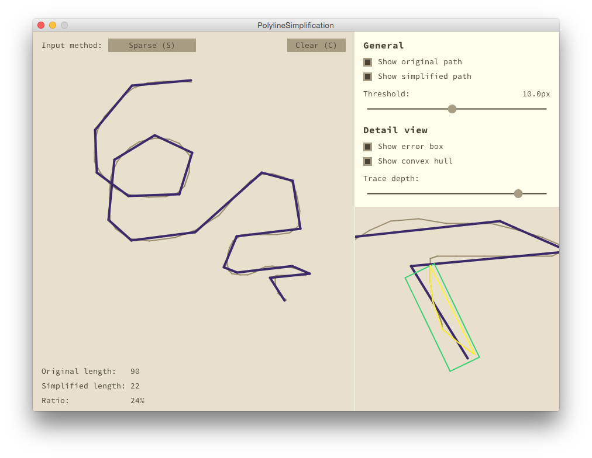

Polyline Simplification
=======================

This project demostrates an original algorithm for polygonal line
simplification. Given a polygonal line, referred to as _path_, we produce
a visually similar path, but with less vertices. The restruction criterion is
_threshold_, which specifies the maximal distance between a point from
original path to the simplified path.

You can view the detailed description at the
[GitHub page](http://mkacz91.github.io/polysim) of this project.
You can also grab the executables in under
[releases](https://github.com/mkacz91/polysim/releases)

The algorithm is, implemented by `PathSimplifier`. It receives an instance of
`Path` as input and provides a simplified path as result. The simplest use case
may be as follows:

    Path path = new Path();
     float threshold = 0.3f;
     PathSimplifier simplifier = new PathSimplifier(path, threshold);
     path.addPoint(3, 0);
     path.addPoint(1, 2);
     . . .
     path.addPoint(-4, 1);
     Path simple = simplifier.getSimplified();

The simplifier may be attached to the path at any moment and the simplified
path may be retrievied at any time. For details, refer to the implementation.
